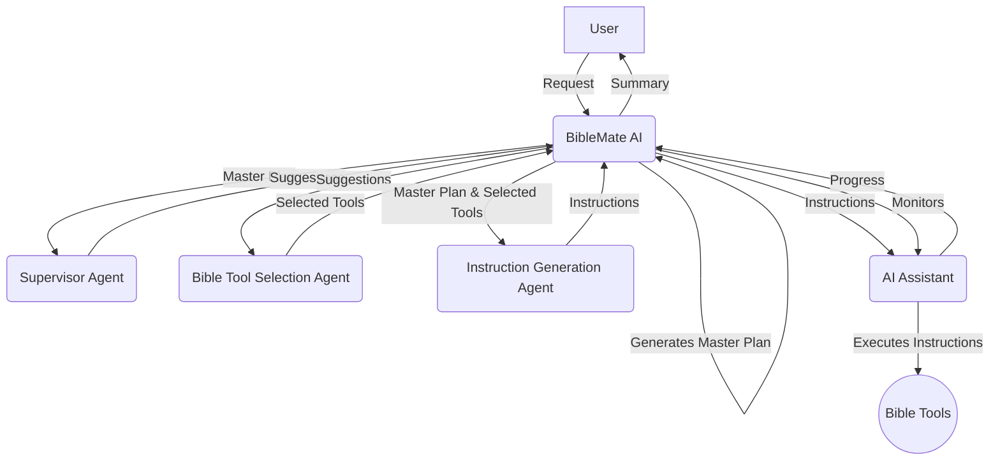

# BibleMate AI

**BibleMate AI** is a groundbreaking, autonomous AI agent designed to revolutionize your Bible study. It can create study plans, coordinate multiple Bible tools, and take multi-step actions to complete complex Bible-related tasks, such as conducting an in-depth study of a particular Bible passage.

Developer: Eliran Wong

## 👀 An Overview

[](https://youtu.be/BxpLmpCm4QU)

## ✨ Core Features

- **Autonomous AI Agent:** BibleMate AI can work independently to fulfill your bible study requests.
- **Multi-step Task Execution:** It can break down complex tasks into smaller, manageable steps and execute them sequentially.
- **Rich Toolset:** Comes with over 40 built-in bible tools, powered by our comprehensive bible suite, the [UniqueBible App](https://github.com/eliranwong/UniqueBible).
- **Customizable and Extensible:** Advanced users can customize existing tools or add new ones to suit their specific needs.
- **Flexible AI Backend:** Supports a variety of AI backends via [AgentMake AI](https://github.com/eliranwong/agentmake).

## 🖥️ Supported Platforms

- Windows
- macOS
- Linux
- ChromeOS
- Android (via Piexel Terminal / Termux)

### Supported Python versions

- 3.10
- 3.11
- 3.12

## 🧠 Supported AI Backends

Powered by AgentMake AI, BibleMate AI offers users the flexibility to use various AI backends. Read more at https://github.com/eliranwong/agentmake#supported-backends

For comparison, we tested some of the supported backends using the same prompt `In-depth study on Lamentations 3:22-24` in the tests below:

BibleMate AI + `Azure + ChatGPT 5` https://youtu.be/QvPIyHOhrP0

BibleMate AI + `Gemini API + Gemini 2.5 Flash` https://youtu.be/AZ-zEl_StC0

BibleMate AI + `Mistral Large` https://youtu.be/7sBfj2TMoOE

BibleMate AI + `DeepSeek 3.1` https://youtu.be/FUr--ULDCZM

BibleMate AI + `Groq + GPT-OSS 120B` https://youtu.be/7sBfj2TMoOE

BibleMate AI + `Groq + Llama 3.3 70B` https://youtu.be/oKQyIEnMM8M

BibleMate AI + `XAI + Grok 4` https://youtu.be/JgcxciOc_Ys

## 🎬 Demo - Agent Mode

[](https://youtu.be/QvPIyHOhrP0)

Another example: [In-depth study on Revelation chapter 7](https://github.com/eliranwong/biblemate/blob/main/test/In-depth_study_on_Revelation_7.md)

## 🧩 Agentic Workflow

1.  **BibleMate AI** receives a request from a user.
2.  **BibleMate AI** analyzes the request and determines that it requires multiple steps to complete.
3.  **BibleMate AI** generates a `Master Plan` that outlines the steps needed to complete the request.
4.  **BibleMate AI** sends the `Master Plan` to a supervisor agent, who reviews the prompt and provides suggestions for improvement.
5.  **BibleMate AI** sends the suggestions to a bible tool selection agent, who selects the most appropriate bible tools for each step of the `Master Plan`.
6.  **BibleMate AI** sends the selected bible tools and the `Master Plan` to an instruction generation agent, who converts the suggestions into clear and concise instructions for an AI assistant to follow.
7.  **BibleMate AI** sends the instructions to an AI assistant, who executes the instructions using the selected bible tools.
8.  **BibleMate AI** monitors the progress of the AI assistant and provides additional suggestions or instructions as needed.
9.  Once all steps are completed, **BibleMate AI** provides a concise summary of the results to the user.
10. The user receives the final response, which fully resolves their original request.

### Workflow Diagram



## 🚀 Quick Start

> pip install --upgrade biblemate

> biblemate

Enter your request in the BibleMate AI prompt.

Enter a blank entry to get some ideas for new requests or follow-up questions.

### Set up virtual environment

For example:

```
cd
python3 -m venv biblemate
source biblemate/bin/activate
pip install --upgrade biblemate
export PATH=$PATH:$HOME/biblemate/bin
biblemate
```

### Support Using Vertex AI

Run:

> pip install --upgrade "biblemate[genai]"

### Upgrade

Run again:

> pip install --upgrade biblemate

### Install Ollama [Optional]

BibleMate AI uses `Ollama` to generate embeddings for semantic searches. You may install it from https://ollama.com/ so that you can perform semantic searches of the Bible with BibleMate AI."

## ⚙️ Configure AI Backend

After BibleMate AI is launched, enter:

> .backend

A text editor is opened for you to edit the AgentMake AI settings. Change the `DEFAULT_AI_BACKEND` to your own choice of AI backend and enter API keys where appropriate.

You may override the default AI backend temporarily by using the CLI option `-b` or `--backend`. For example,

> biblemate -b groq

## 🗣️ AI Modes

You can select between three AI modes to suit your preferences:

*   **Chat mode** – Provides direct text responses without using tools, ideal for simple queries.
*   **Agent mode** – A fully autonomous agent designed to plan, orchestrate tools, and take multiple actions to address user requests.
*   **Partner mode** – A semi-automated mode that involves you in the process with review and edit prompts, giving you more control over the AI's actions.

`Partner mode` is set as the default on fresh installation.

To switch between modes, use the `.mode` command in the BibleMate AI prompt. This will open a selection dialog where you can choose your preferred mode.


## 📚 Built-in Tools & Plans

### Built-in Tools

To see the full list of built-in tools and their descriptions, please see the [TOOLS.md](TOOLS.md) file.

To enable or disable some of the tools, enter `.tools` in the BibleMate AI prompt.

When `agent mode` is enabled, all enabled built-in tools are considered and automatically selected for each step in fulfilling the user’s request.

### Built-in Plans

Built-in plans are predefined, frequently used 'master plans' that users can quickly access. Currently, we have added two built-in plans for demonstration purposes. Users can add their own plans via [customization](https://github.com/eliranwong/biblemate#customization).

Starts your prompt with a forward slash `/` to call a plan, e.g.:

> /simple_bible_study John 3:16

> /bible_devotion Deut 6:4

## 🛠️ Single Tool Selection

In some cases, you may want to specify a particular tool for a simple task, rather than having multiple tools automatically selected in the fully automatic `agent mode`.

You can specify a single tool by prefixing a tool name with `@` at the beginning of your prompt. For example,

```
@retrieve_bible_cross_references Deut 6:4; John 3:16
```

Watch this video: https://youtu.be/50m1KRj6uhs

BibleMate AI can also automatically select a single tool to address your request. Simply begin your request with `@` followed by a space, instead of specifying a tool name. For example,

```
@ Read Deut 6:4; John 3:16
```

## 📝 Custom Master Plan

In some cases, you may want to specify a `custom plan` with multiple tools specified for different steps for a complex task, rather than having a `master plan` automatically generated in fully automatic agent mode.

You can use a custom 'Master Plan' of your own, instead of one generated by BibleMate AI. To do this, start your BibleMate AI prompt with '@@' followed by your own master plan for a Bible study. 

For example,

```
@@ Analyze John 3:16 with the following steps: 
1. Call tool 'retrieve_english_bible_verses' for Bible text, 
2. Call tool 'retrieve_bible_cross_references' for Bible cross-references, 
3. Call tool 'interpret_new_testament_verse' for interpretation, and 
4. Call tool 'write_bible_theology' to explain its theology.
```

Watch this video: https://youtu.be/Lejq0sAx030

Another example:

```
@@ Write touching devotion on Deuteronomy 6:4 with the following steps:
1. Analyze the themes using @study_old_testament_themes
2. Identify and explain key biblical keywords from the passage using @identify_bible_keywords
3. Write insights for the devotion using @write_bible_insights
4. Relate the passage to daily life using @write_bible_applications
5. Compose a touching devotion using @write_bible_devotion.
Ensure each step is clearly addressed and the final output is cohesive and inspiring
```

Watch this video: https://youtu.be/NYPyujFG09E

The '@@' trick works even when you are using 'chat' mode with 'agent' mode disabled.

## 🏃 Action Menu

| Command              | Description                        |
|----------------------|------------------------------------|
| `.new`               | New conversation                   |
| `.quit`              | Quit BibleMate AI                  |
| `.backend`           | Change backend                     |
| `.mode`              | Change AI mode                     |
| `.tools`             | List available tools               |
| `.plans`             | List available plans               |
| `.resources`         | List available resources           |
| `.backup`            | Backup conversation                |
| `.load`              | Load a saved conversation          |
| `.open`              | Open a file or directory           |
| `.promptengineer`    | Toggle auto prompt engineering     |
| `.lite`              | Toggle lite context                |
| `.steps`             | Set max number of steps            |
| `.matches`           | Set max number of semantic matches |
| `.help`              | Show help page                     |

Remarks:

* Use `.lite` to enable or disable lite context. When lite context is enabled, BibleMate runs faster, with a slight trade‑off in tool response quality.
* To use `.load`, you need to specify a python file that contains a saved conversation.  Conversation is saved into a file each time when a backup is executed. Check the message `Conversation backup saved to ...` or locate the backups in `~/agentmake/xomate`.
* To use `.open`, you need to specify a file or a directory that is to be opened.

## ✝️ UniqueBible Resources

We bring the best of both worlds together in BibleMate AI to enhance your Bible studies. In addition to dynamic AI tools, we have integrated direct access to most [UniqueBible resources](https://github.com/eliranwong/UniqueBible) via BibleMate AI prompts. At any point during a conversation with the AI agent, you can incorporate UniqueBible App data directly into the discussion to enrich the study flow and content.

Type `.resources` in the BibleMate AI prompt to view the available resources. The number of available UniqueBible resources depends on which [UniqueBible web server](https://github.com/eliranwong/UniqueBible) you configured in the backend settings. By default, BibleMate AI uses the UniqueBible web server running at https://bible.gospelchurch.uk. The UniqueBible server is highly customizable; you may set up a local server with your custom resources to use with BibleMate AI.

To connect BibleMate AI with your local server, enter `.backend` in the BibleMate AI prompt, locate the session below, and fill in your local server details:

```
# Tool: UBA API
UBA_API_LOCAL_PORT=8080
UBA_API_ENDPOINT="http://127.0.0.1:8080/plain"
UBA_API_TIMEOUT=10
UBA_API_PRIVATE_KEY=
```

Tips: Start your prompt with `//` to view available resources from the input suggestions.

## 🔎 Semantic Searches [Optional]

To enable semantic searches, you must first download a few data files. Type `.download` in the BibleMate AI prompt and follow the pop‑up dialog to download them.

You can also download the files manually, unzip them, and place them in the directory `~/agentmake/biblemate/data`, where `~` represents the user's home directory:

[bible.db](https://drive.google.com/file/d/1E6pDKfjUMhmMWjjazrg5ZcpH1RBD8qgW/view?usp=sharing)

Examples:

> @search_the_whole_bible God create

> @search_john_only Jesus love

[collection.db](https://drive.google.com/file/d/1y4txzRzXTBty0aYfFgkWfz5qlHERrA17/view?usp=sharing)

Examples:

> //promise/hope

> //parallel/baptism

[dictionary.db](https://drive.google.com/file/d/1UxDKGEQa7UEIJ6Ggknx13Yt8XNvo3Ld3/view?usp=sharing)

Example:

> //dictionary/Israel

[encyclopedia.db](https://drive.google.com/file/d/1NLUBepvFd9UDxoGQyQ-IohmySjjeis2-/view?usp=sharing)

Examples:

> //encyclopedia/Jesus

> //encyclopedia/ISB/Jesus

[exlb.db](https://drive.google.com/file/d/1Hpo6iLSh5KzgR6IZ-c7KuML--A3nmP1-/view?usp=sharing)

Examples:

> //topic/hope

> //name/Bethleham

> //character/Samuel

> //location/Jerusalem

## ⌨️ Keyboard Shortcuts

The following key bindings are supported in BibleMate AI prompt field:

- `Ctrl+N` new conversation
- `Ctrl+Q` quit
- `Ctrl+C` copy selected prompt text
- `Ctrl+V` paste text in a prompt
- `Ctrl+I` or `TAB` new line
- `Ctrl+Z` clear prompt text
- `Esc+a` jump to the beginning of a prompt
- `Esc+z` jump to the end of a prompt
- `Esc+b` or `HOME` jump to the beginning of a line in a prompt
- `Esc+e` or `END` jump to the end of a line in a prompt

## 🛠️ Customization

BibleMate AI is highly customizable. Advanced users can modify existing tools, create new ones, and even change the behavior of the AI agent by customizing system prompts.

Custom files are placed in the `biblemate` sub-directory within the AgentMake user directory (typically `~/.agentmake/biblemate` on Linux/macOS or `%USERPROFILE%\.agentmake\biblemate` on Windows).

### Override system prompts

The agent's core logic is guided by system prompts, which are markdown files. You can override them by placing your own versions in `~/.agentmake/systems/biblemate/`.

The customizable system prompt files are: `supervisor.md`, `tool_instruction.md`, and `tool_selection.md`. You can copy them from the `biblemate/systems` directory in the package installation folder to your user directory and modify them as needed.

### Add or Modify Tools & Plans

You can add your own tools and built-in plans (prompts) by creating a custom `bible_study_mcp.py` file.

1.  First, locate the built-in `bible_study_mcp.py` file inside the `biblemate` package installation directory.
2.  Copy this file to your user customization directory at `~/.agentmake/biblemate/bible_study_mcp.py`.
3.  Now you can edit this file to add or modify tools and prompts using the `fastmcp` syntax. BibleMate AI will automatically load your custom file instead of the built-in one.

### Use http as transport instead of stdio

BibleMate use `stdio` as the default transport for interacting with BibleMate MCP server.  You may use `http` instead.

Run in a thread:

> biblematemcp

Run in another thread:

> biblemate -mcp biblemate

### Use Local Bible Data

Read [HERE](https://github.com/eliranwong/biblemate/issues/15#issuecomment-3314130281) for more details.

### Use Custom MCP Server

You may use a custom MCP server via CLI option `mcp`, e.g.:

> biblemate -mcp http://127.0.0.1:33333/mcp

### Host or Run a BibleMate MCP Server

Use default port `33333`:

> biblematemcp

The default port can be edited in the configuration file `config.py`.

To override the default port temporaily, e.g.:

> biblematemcp -p 33334

## 📖 Tutorials

... (coming soon) ...

## 📄 License

This project is licensed under the Creative Commons Attribution-NonCommercial 4.0 International License - see the [LICENSE](LICENSE) file for details.

## 🙏 Acknowledgments

BibleMate AI is built upon the foundations of our other projects:
*   [UniqueBible App](https.github.com/eliranwong/UniqueBible)
*   [XoMate AI](https.github.com/eliranwong/xomate)
*   [AgentMake AI](https.github.com/eliranwong/agentmake)
*   [AgentMake AI MCP](https.github.com/eliranwong/agentmakemcp)
