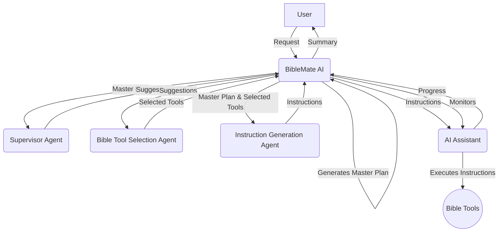

# BibleMate AI

BibleMate AI is a groundbreaking, autonomous AI agent designed to revolutionize your Bible study. It can create study plans, coordinate multiple Bible tools, and take multi-step actions to complete complex Bible-related tasks, such as conducting an in-depth study of a particular Bible passage.

## Core Features

*   **Autonomous AI Agent:** BibleMate AI can work independently to fulfill your bible study requests.
*   **Multi-step Task Execution:** It can break down complex tasks into smaller, manageable steps and execute them sequentially.
*   **Rich Toolset:** Comes with over 40 built-in bible tools, powered by our comprehensive bible suite, the [UniqueBible App](https://github.com/eliranwong/UniqueBible).
*   **Customizable and Extensible:** Advanced users can customize existing tools or add new ones to suit their specific needs.

## Demo

See BibleMate AI in action in our YouTube video: [BibleMate AI Demo](https://www.youtube.com/watch?v=2BPZVufnKJU&feature=youtu.be)

## Our Other AI Projects

BibleMate AI was developed from our agent development kit (ADK), [AgentMake AI](https://github.com/eliranwong/agentmake), and was a side-project we explored while developing [BibleMate AI](https://github.com/eliranwong/BibleMate). Its success as a bible study tool prompted us to develop it further as a standalone project.

## BibleMate AI Agentic Workflow

1.  **BibleMate AI** receives a request from a user.
2.  **BibleMate AI** analyzes the request and determines that it requires multiple steps to complete.
3.  **BibleMate AI** generates a `Master Plan` that outlines the steps needed to complete the request.
4.  **BibleMate AI** sends the `Master Plan` to a supervisor agent, who reviews the prompt and provides suggestions for improvement.
5.  **BibleMate AI** sends the suggestions to a bible tool selection agent, who selects the most appropriate bible tools for each step of the `Master Plan`.
6.  **BibleMate AI** sends the selected bible tools and the `Master Plan` to an instruction generation agent, who converts the suggestions into clear and concise instructions for an AI assistant to follow.
7.  **BibleMate AI** sends the instructions to an AI assistant, who executes the instructions using the selected bible tools.
8.  **BibleMate AI** monitors the progress of the AI assistant and provides additional suggestions or instructions as needed.
9.  Once all steps are completed, **BibleMate AI** provides a concise summary of the results to the user.
10. The user receives the final response, which fully resolves their original request.

## Workflow Diagram

## Getting Started

*(Coming soon)*

## Customization

*(Coming soon)*

## License

This project is licensed under the Creative Commons Attribution-NonCommercial 4.0 International License - see the [LICENSE](LICENSE) file for details.

## Acknowledgments

BibleMate AI is built upon the foundations of our other projects:
*   [AgentMake AI](https.github.com/eliranwong/agentmake)
*   [BibleMate AI](https.github.com/eliranwong/BibleMate)
*   [UniqueBible App](https.github.com/eliranwong/UniqueBible)