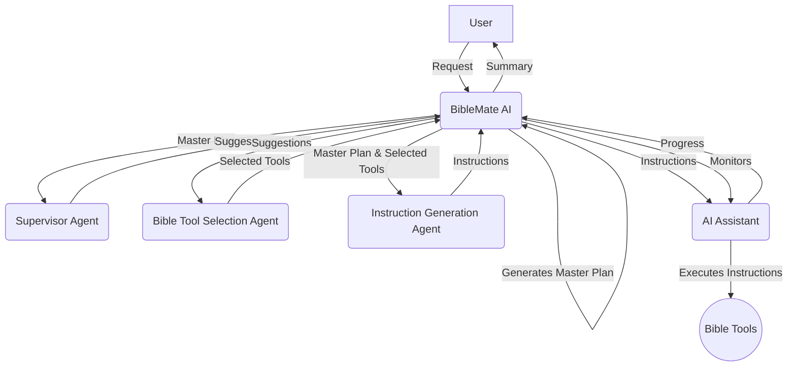

# BibleMate AI

**BibleMate AI** is a groundbreaking, autonomous AI agent designed to revolutionize your Bible study. It can create study plans, coordinate multiple Bible tools, and take multi-step actions to complete complex Bible-related tasks, such as conducting an in-depth study of a particular Bible passage.

## ✨ Core Features

- **Autonomous AI Agent:** BibleMate AI can work independently to fulfill your bible study requests.
- **Multi-step Task Execution:** It can break down complex tasks into smaller, manageable steps and execute them sequentially.
- **Rich Toolset:** Comes with over 40 built-in bible tools, powered by our comprehensive bible suite, the [UniqueBible App](https://github.com/eliranwong/UniqueBible).
- **Customizable and Extensible:** Advanced users can customize existing tools or add new ones to suit their specific needs.
- **Flexible AI Backend:** Supports a variety of AI backends via [AgentMake AI](https://github.com/eliranwong/agentmake).

## 🖥️ Supported Platforms

- Windows
- macOS
- Linux
- ChromeOS
- Android (via Piexel Terminal / Termux)

## 🧠 Supported AI Backends

Powered by AgentMake AI, BibleMate AI offers users the flexibility to use various AI backends. Read more at https://github.com/eliranwong/agentmake#supported-backends

For comparison, we tested some of the supported backends using the same prompt `In-depth study on Lamentations 3:22-24` in the tests below:

BibleMate AI + `Azure + ChatGPT 5` https://youtu.be/QvPIyHOhrP0

BibleMate AI + `Gemini API + Gemini 2.5 Flash` https://youtu.be/AZ-zEl_StC0

BibleMate AI + `Mistral Large` https://youtu.be/7sBfj2TMoOE

BibleMate AI + `DeepSeek 3.1` https://youtu.be/FUr--ULDCZM

BibleMate AI + `Groq + GPT-OSS 120B` https://youtu.be/7sBfj2TMoOE

BibleMate AI + `Groq + Llama 3.3 70B` https://youtu.be/oKQyIEnMM8M

BibleMate AI + `XAI + Grok 4` https://youtu.be/JgcxciOc_Ys

## 🎬 Demo

[](https://youtu.be/QvPIyHOhrP0)

## 🧩 Agentic Workflow

1.  **BibleMate AI** receives a request from a user.
2.  **BibleMate AI** analyzes the request and determines that it requires multiple steps to complete.
3.  **BibleMate AI** generates a `Master Plan` that outlines the steps needed to complete the request.
4.  **BibleMate AI** sends the `Master Plan` to a supervisor agent, who reviews the prompt and provides suggestions for improvement.
5.  **BibleMate AI** sends the suggestions to a bible tool selection agent, who selects the most appropriate bible tools for each step of the `Master Plan`.
6.  **BibleMate AI** sends the selected bible tools and the `Master Plan` to an instruction generation agent, who converts the suggestions into clear and concise instructions for an AI assistant to follow.
7.  **BibleMate AI** sends the instructions to an AI assistant, who executes the instructions using the selected bible tools.
8.  **BibleMate AI** monitors the progress of the AI assistant and provides additional suggestions or instructions as needed.
9.  Once all steps are completed, **BibleMate AI** provides a concise summary of the results to the user.
10. The user receives the final response, which fully resolves their original request.

### Workflow Diagram



## 🚀 Quick Start

> pip install --upgrade biblemate

> biblemate

Enter your request in the BibleMate AI prompt.

Enter a blank entry to get some ideas for new requests or follow-up questions.

## ⚙️ Configure AI Backend

After BibleMate AI is launched, enter:

> .backend

A text editor is opened for you to edit the AgentMake AI settings. Change the `DEFAULT_AI_BACKEND` to your own choice of AI backend and enter API keys where appropriate.

## 🗣️ AI Modes

You can swap between two AI modes:

Chat mode – Provide users with direct text responses without using tools. This is useful when users have simple queries and need straightforward answers.

Agent mode - Fully autonomous agent designed to plan, orchestrate tools, and take multiple actions to address user requests.

How to swap?

* Enter `.chat` in BibleMate AI prompt to enable chat mode and disable agent mode.
* Enter `.agent` in BibleMate AI prompt to enable agent mode and disable chat mode.

## 📚 Built-in Tools & Plans

### Built-in Tools

To see the full list of built-in tools and their descriptions, please see the [TOOLS.md](TOOLS.md) file.

When `agent mode` is enabled, all built-in tools are considered and automatically selected for each step in fulfilling the user’s request.

### Built-in Plans

Built-in plans are predefined, frequently used 'master plans' that users can quickly access. Currently, we have added two built-in plans for demonstration purposes. Users can add their own plans via [customization](https://github.com/eliranwong/biblemate#customization).

Starts your prompt with a forward slash `/` to call a plan, e.g.:

> /simple_bible_study John 3:16

> /bible_devotion Deut 6:4

## 🛠️ Manual Tool Selection

In some cases, you may want to specify a particular tool for a simple task, rather than having a tool automatically selected in the fully automatic `agent mode`.

You can specify a single tool by prefixing a tool name with `@` at the beginning of your prompt. For example,

```
@retrieve_bible_cross_references Deut 6:4; John 3:16
```

Watch this video: https://youtu.be/50m1KRj6uhs

## 📝 Custom Master Plan

In some cases, you may want to specify a `custom plan` with multiple tools specified for different steps for a complex task, rather than having a `master plan` automatically generated in fully automatic agent mode.

You can use a custom 'Master Plan' of your own, instead of one generated by BibleMate AI. To do this, start your BibleMate AI prompt with '@@' followed by your own master plan for a Bible study. 

For example,

```
@@ Analyze John 3:16 with the following steps: 
1. Call tool 'retrieve_english_bible_verses' for Bible text, 
2. Call tool 'retrieve_bible_cross_references' for Bible cross-references, 
3. Call tool 'interpret_new_testament_verse' for interpretation, and 
4. Call tool 'write_bible_theology' to explain its theology.
```

Watch this video: https://youtu.be/Lejq0sAx030

Another example:

```
@@ Write touching devotion on Deuteronomy 6:4 with the following steps:
1. Analyze the themes using @study_old_testament_themes
2. Identify and explain key biblical keywords from the passage using @identify_bible_keywords
3. Write insights for the devotion using @write_bible_insights
4. Relate the passage to daily life using @write_bible_applications
5. Compose a touching devotion using @write_bible_devotion.
Ensure each step is clearly addressed and the final output is cohesive and inspiring
```

Watch this video: https://youtu.be/NYPyujFG09E

The '@@' trick works even when you are using 'chat' mode with 'agent' mode disabled.

## 🏃 Action Menu

| Command              | Description                        |
|----------------------|------------------------------------|
| `.new`               | New conversation                   |
| `.quit`              | Quit BibleMate AI                  |
| `.backend`           | Change backend                     |
| `.chat`              | Enable chat mode                   |
| `.agent`             | Enable agent mode                  |
| `.tools`             | List available tools               |
| `.plans`             | List available plans               |
| `.backup`            | Backup conversation                |
| `.open`              | Open a file or directory           |
| `.promptengineering` | Toggle auto prompt engineering     |
| `.steps`             | Set max number of steps            |
| `.help`              | Show help page                     |

## ⌨️ Keyboard Shortcuts

The following key bindings are supported in BibleMate AI prompt field:

- `Ctrl+N` new conversation
- `Ctrl+Q` quit
- `Ctrl+C` copy selected prompt text
- `Ctrl+V` paste text in a prompt
- `Ctrl+I` or `TAB` new line
- `Ctrl+Z` clear prompt text
- `Esc+a` jump to the beginning of a prompt
- `Esc+z` jump to the end of a prompt
- `Esc+b` or `HOME` jump to the beginning of a line in a prompt
- `Esc+e` or `END` jump to the end of a line in a prompt

## 🛠️ Customization

BibleMate AI is highly customizable. Advanced users can modify existing tools, create new ones, and even change the behavior of the AI agent by customizing system prompts.

Custom files are placed in the `biblemate` sub-directory within the AgentMake user directory (typically `~/.agentmake/biblemate` on Linux/macOS or `%USERPROFILE%\.agentmake\biblemate` on Windows).

### Add or Modify Tools & Plans

You can add your own tools and built-in plans (prompts) by creating a custom `bible_study_mcp.py` file.

1.  First, locate the built-in `bible_study_mcp.py` file inside the `biblemate` package installation directory.
2.  Copy this file to your user customization directory at `~/.agentmake/biblemate/bible_study_mcp.py`.
3.  Now you can edit this file to add or modify tools and prompts using the `fastmcp` syntax. BibleMate AI will automatically load your custom file instead of the built-in one.

### Override system prompts

The agent's core logic is guided by system prompts, which are markdown files. You can override them by placing your own versions in `~/.agentmake/systems/biblemate/`.

The customizable system prompt files are: `supervisor.md`, `tool_instruction.md`, and `tool_selection.md`. You can copy them from the `biblemate/systems` directory in the package installation folder to your user directory and modify them as needed.

## 📖 Tutorials

... (coming soon) ...

## 📄 License

This project is licensed under the Creative Commons Attribution-NonCommercial 4.0 International License - see the [LICENSE](LICENSE) file for details.

## 🙏 Acknowledgments

BibleMate AI is built upon the foundations of our other projects:
*   [UniqueBible App](https.github.com/eliranwong/UniqueBible)
*   [XoMate AI](https.github.com/eliranwong/xomate)
*   [AgentMake AI](https.github.com/eliranwong/agentmake)
*   [AgentMake AI MCP](https.github.com/eliranwong/agentmakemcp)
